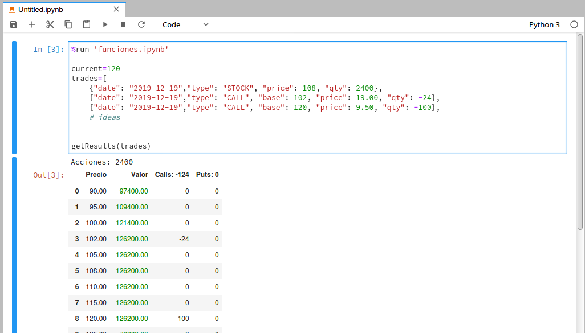

# rodi_python

Es un conjunto de funciones que permiten implementar una *Planilla Ford T* usando [https://jupyter.org](JupyterLab). 
También contiene funciones para obtener datos de *Rodi*.  

Sobre la *Planilla Ford T*: es la denominación que le puso Francisco Mancuso a su planilla básica (básica en comparación con la de @gcutte) para operar opciones [https://www.youtube.com/watch?v=oArjAhDeRaw](https://www.youtube.com/watch?v=oArjAhDeRaw).  

## Modo de uso

Aquellos entendidos en Python pueden usar las funciones diréctamente desde línea de comandos, 
o bien usarlas desde JupyterLab.

## Desde JupyterLab

1. Instalar JupyterLab.
2. Clonar este repositorio, por ej. en /home/leonardo/rodi_python o c:\rodi_python.
3. Posicionarse en el directorio anteriormente clonado.
4. ejecutar JupyterLab, en Linux `jupyterlab`. Se abrirá el navegador web apuntando a `http://localhost:8888/lab`.

### Acceso a datos en tiempo real

Crear el archivo `bonos.ipynb` con el siguiente contenido:  

```
%run 'funciones.ipynb'
import time
from IPython.display import clear_output, display
login_rodi("usuario_rodi", "password_rodi")
while True:
    d=datapack()
    # Vencimiento 1: CI, 3: 48hs
    af20_ci=getRealtimeData(d['d']['aTabla'], "AF20", 1)["PrecioUltimo"]
    af20_48=getRealtimeData(d['d']['aTabla'], "AF20", 3)["PrecioUltimo"]    
    ay24_ci=getRealtimeData(d['d']['aTabla'], "AY24", 1)["PrecioUltimo"]
    ay24_48=getRealtimeData(d['d']['aTabla'], "AY24", 3)["PrecioUltimo"]
    #ao20_ci=getRealtimeData(d['d']['aTabla'], "AO20", 1)["PrecioUltimo"]
    ao20_48=getRealtimeData(d['d']['aTabla'], "AO20", 3)["PrecioUltimo"]    
    clear_output(wait=True)
    print("AF20: " + str(af20_48))    
    print("AY24: " + str(ay24_48))
    print("AO20: " + str(ao20_48))
    print("AY24/AO20: " + str(ay24_48/ao20_48))
    print(8250*ay24_48/100/ao20_48*100)
    # debajo de 0.90 me conviene vender el AO20 y comprar AY24
    # arriba de 0.90 me conviene vender el AY24 y comprar AO20
    time.sleep(5)
```

### Planilla Ford T

En forma similar a la planilla *Ford T* de Francisco Mancuso desarrollé esta librería, que permite cargar
los datos de los trades en formato *JSON*. 


En el mismo directorio que el archivo `funciones.json` crear el siguiente archivo dentro de *JupyterLab*:  

```
%run 'funciones.ipynb'

current=120
trades=[
    {"date": "2019-12-19","type": "STOCK", "price": 108, "qty": 2400},     
    {"date": "2019-12-19","type": "CALL", "base": 102, "price": 19.00, "qty": -24},     
    {"date": "2019-12-19","type": "CALL", "base": 120, "price": 9.50, "qty": -100}, 
    # ideas
]

getResults(trades)
```

Debería quedar así:  


